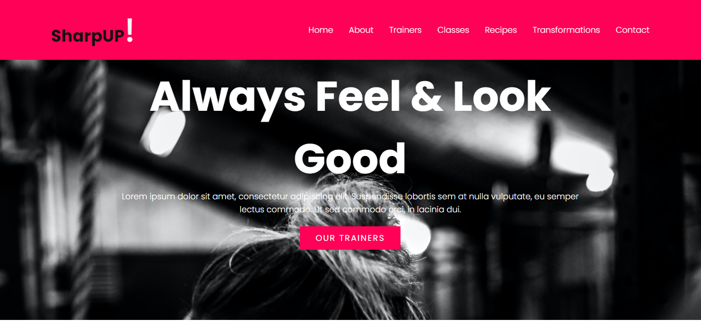
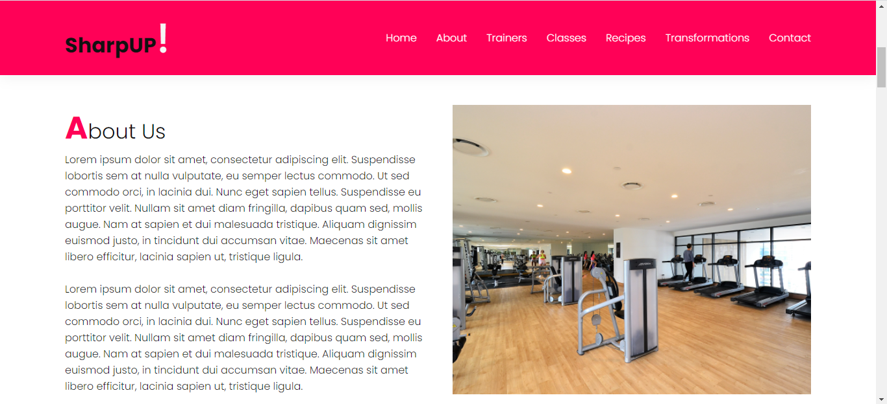
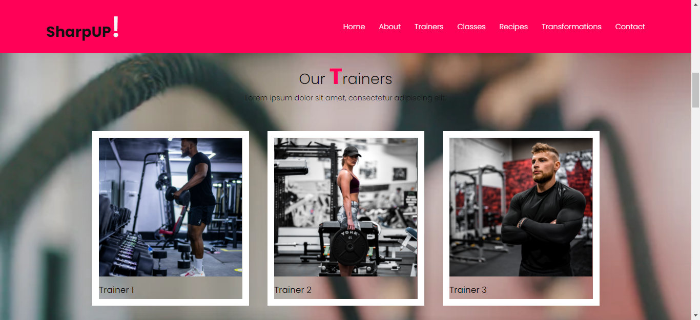
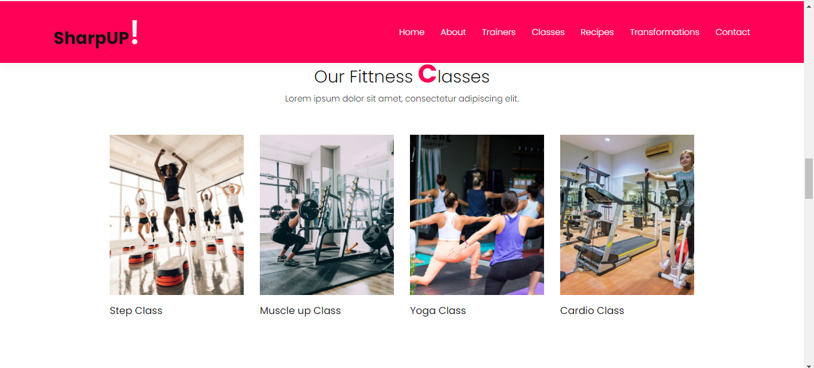
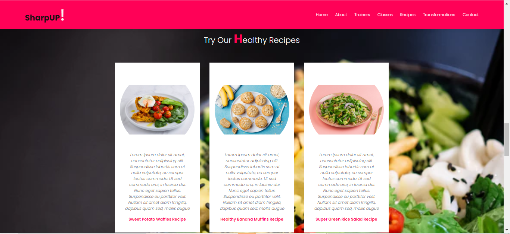
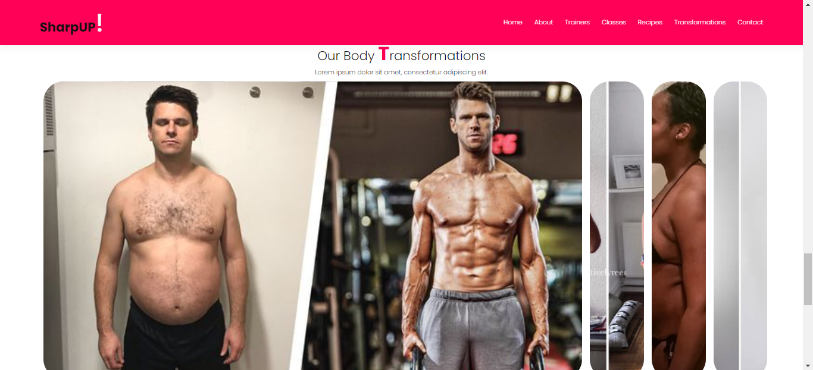
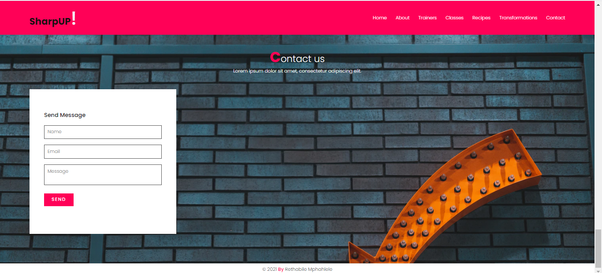

<h1> SharpUp Gym Website</h1>

This is a simple website created using Visual Studio Code, HTML, CSS and Javacript for a GirlCode Software Development project.

The SharpUp!, is a gym which offers classes and trainers to help individuals achieve their health goals 

 

<h1>Website Screenshots</h1>
The website consists of 7 sections which are as follows below.
 
 
<h2> 1. Landing page </h2>

 
 
<h2> 2. About us page </h2>

 
 
<h2> 3. Trainers page </h2>

 
 
<h2> 4. Classes page </h2>

 
 
<h2> 5. Recipes page </h2>

 
 
<h2> 6. Transformations page </h2>

 
 
<h2> 7. Contact page </h2>

 
 

<h1>Technologies used</h1>

 The technologies that were used to build this website are as follows;

<ol>
    <li>HTML</li>
    <li>CSS</li>
    <li>JavaScript</li>
    <li>Visual Studio Code</li>
</ol>

<h1>Live Demo</h1>

https://retha05m.github.io/SharpUp-Website/

<h1>Clone the code:</h1>

 You can clone this project using the below link;

git clone -https://github.com/Retha05M/SharpUp-Website

<h1>Thank you</h1>

